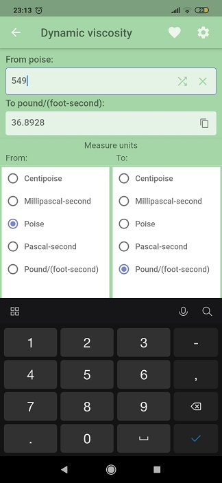

### Units converter (Dart/Flutter)

A simple tool for conversion between different units of measurement. Feel free to use for your educational purpose.
* Different measures calculator. Simple way to add new categories and measures via mixins;
* Save users preferences to SharedPreferences (such as last used measures, favorites, settings);
* Different localizations;
* Supports Dark/Light mode.

  
  
  

